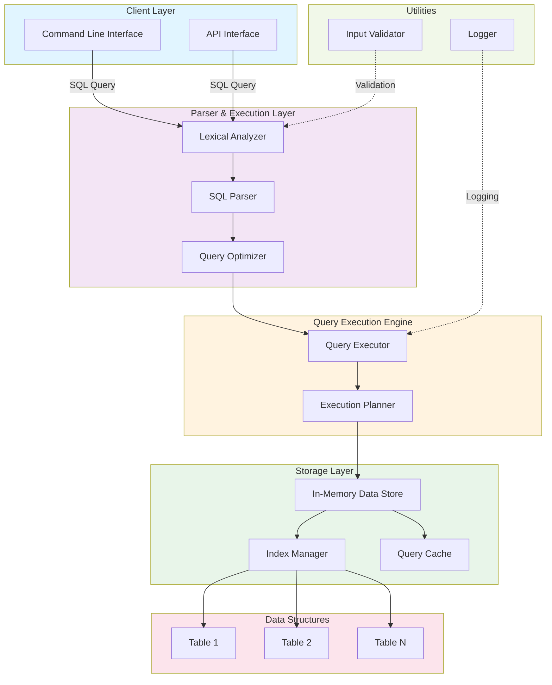

# In-Memory SQL Database - Architecture Overview

This document provides a high-level overview of the in-memory SQL database architecture.

## System Architecture

## Component Descriptions

### Client Layer
- **Command Line Interface**: User-facing CLI for executing SQL commands
- **API Interface**: Programmatic interface for application integration

### Parser & Execution Layer
- **Lexical Analyzer**: Tokenizes SQL input into meaningful units
- **SQL Parser**: Parses tokens into an abstract syntax tree (AST)
- **Query Optimizer**: Optimizes the execution plan for better performance

### Query Execution Engine
- **Query Executor**: Executes the optimized query plan
- **Execution Planner**: Converts optimized query into executable steps

### Storage Layer
- **In-Memory Data Store**: Stores all table data in RAM for fast access
- **Index Manager**: Manages indexes for optimized data retrieval
- **Query Cache**: Caches frequently executed queries for performance

### Data Structures
- **Tables**: Individual table storage with rows and columns

### Utilities
- **Logger**: Logs system operations and debugging information
- **Input Validator**: Validates SQL input before processing

## Data Flow

1. User submits SQL query through CLI or API
2. Lexer tokenizes the query string
3. Parser builds an AST from tokens
4. Optimizer analyzes and optimizes the execution plan
5. Executor runs the optimized plan
6. Results are retrieved from in-memory storage
7. Results are returned to the user

## Key Features

- **In-Memory Storage**: All data resides in memory for O(1) access patterns
- **SQL Support**: Full SQL query parsing and execution
- **Indexing**: Supports efficient data retrieval through indexes
- **Query Caching**: Improves performance for repeated queries
- **CLI & API Interfaces**: Multiple ways to interact with the database
