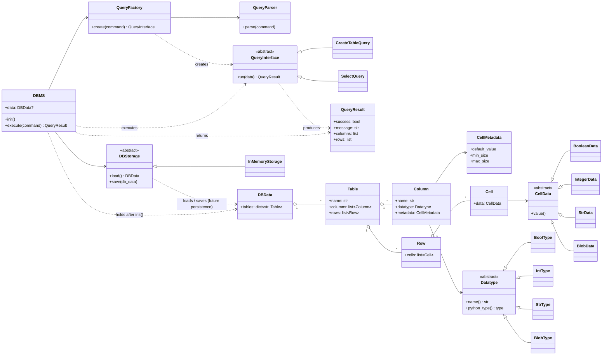

# Class Diagram

Core classes and relationships, derived from the original design diagram and
updated to match implemented names (`CellMetadata` attached to `Column`;
`DBStorage` placeholder added for future persistence; `DBMS` requires
injected storage + factory and an explicit `init()`).

