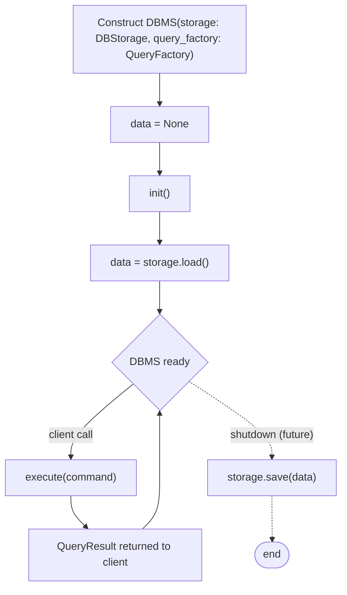
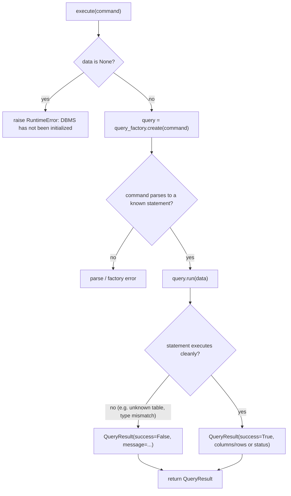

# Flowchart — DBMS Lifecycle and Query Execution

Two zoom levels of the same flow: the high-level DBMS lifecycle, and the
detail of a single `execute(command)` call.

## 1. DBMS lifecycle (high level)

The dashed shutdown path is not implemented in this phase — it marks where
persistence will attach later without changing the rest of the flow.

## 2. execute(command) detail

Open design point (to settle when implementing the parser/factory): whether
a parse/factory error (the `parse / factory error` node) raises an exception
to the caller or is converted into `QueryResult(success=False, ...)` like
statement-level errors. Statement-level errors are already decided:
they return a failed `QueryResult`, they do not raise.
