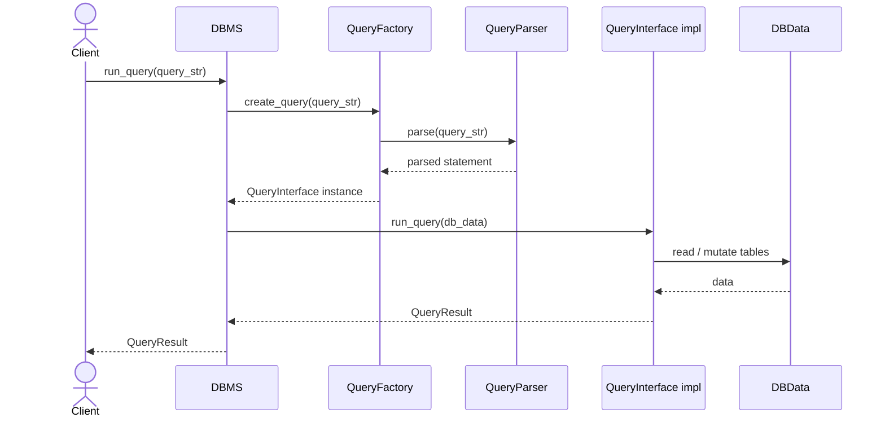

# Sequence Diagram — Running a Query

Statement lifecycle from client call to returned result, derived from the
original design diagram and updated to match implemented method names.

```mermaid
sequenceDiagram
    actor Client
    participant DBMS
    participant QueryFactory
    participant QueryParser
    participant Query as QueryInterface impl
    participant DBData

    Client->>DBMS: run_query(query_str)
    DBMS->>QueryFactory: create_query(query_str)
    QueryFactory->>QueryParser: parse(query_str)
    QueryParser-->>QueryFactory: parsed statement
    QueryFactory-->>DBMS: QueryInterface instance
    DBMS->>Query: run_query(db_data)
    Query->>DBData: read / mutate tables
    DBData-->>Query: data
    Query-->>DBMS: QueryResult
    DBMS-->>Client: QueryResult
```
